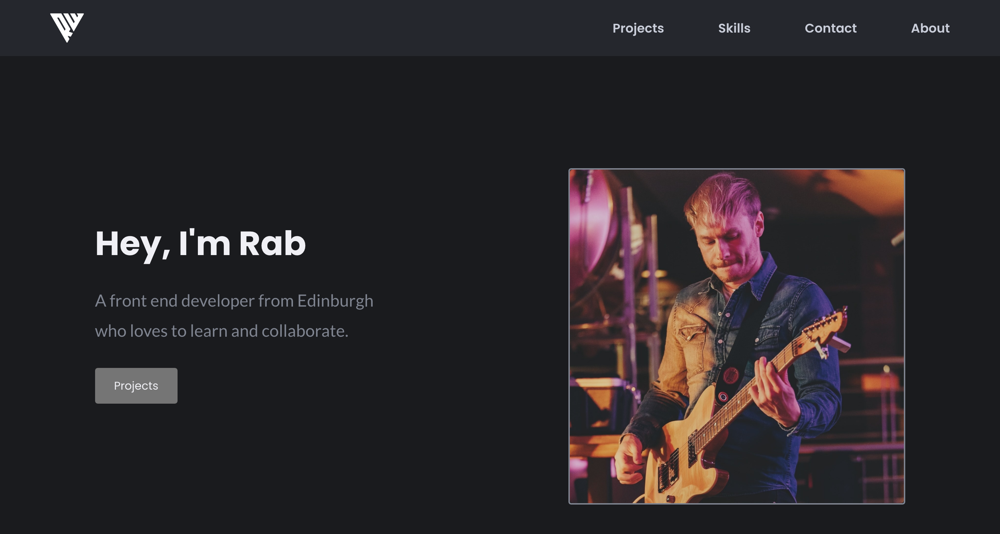

# Rab Winter Portfolio

This is the portfolio website for Rab Winter - Front End Developer (https://rabwinter.com).

## Table of contents

- [Overview](#overview)
  - [Screenshot](#screenshot)
  - [Links](#links)
- [My process](#my-process)
  - [Built with](#built-with)
  - [What I learned](#what-i-learned)
  - [Continued development](#continued-development)
  - [Useful resources](#useful-resources)
- [Author](#author)
- [Acknowledgments](#acknowledgments)

## Overview
A fully responsive site to house my projects, skills and contact info.

### Screenshot

### Links

- [Live site](https://rabwinter.com)
- [Source Code](https://github.com/RabWinter/portfolio-main)

## My process

### Built with

- Semantic HTML5 markup
- Custom SCSS/CSS
- JS/ES6
- Flexbox
- Grid
- Mobile-first workflow

### Notes
Built with simplicity and functionality in mind, the site contains a classic hamburger mobile menu, sticky nav bar and scroll-to smooth scrolling. All courtesy of Vanilla JavaScript.

### Continued development

As my portfolio continues to grow, so will my website! I am also currently learning REACT so hopefully the next iteration of my site will be built using the framework.

## Author

- Website - [rabwinter.com](https://rabwinter.com)
- Frontend Mentor - [@Rwinter88](https://www.frontendmentor.io/profile/Rwinter88)
- LinkedIn - [Rab Winter](https://www.linkedin.com/in/rab-winter-4498a977/)

